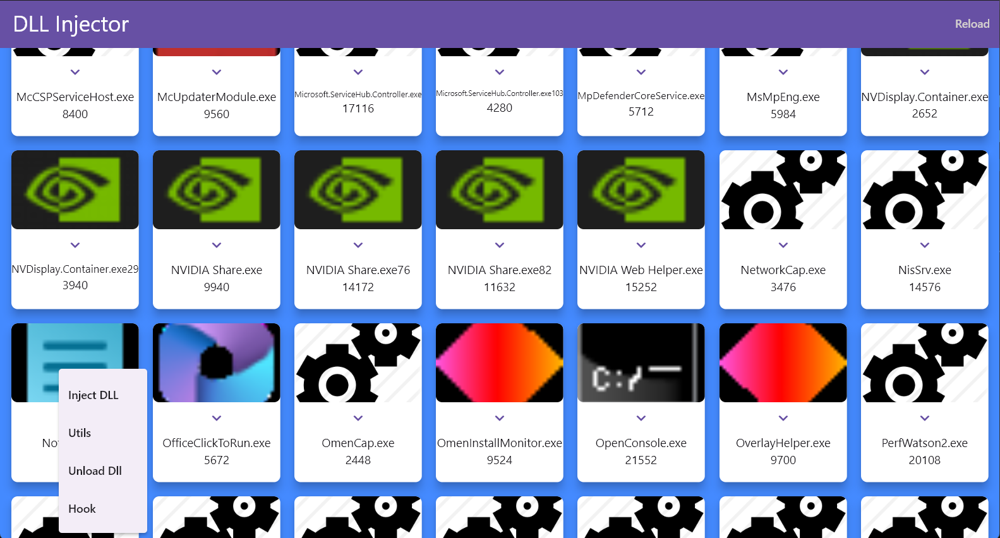
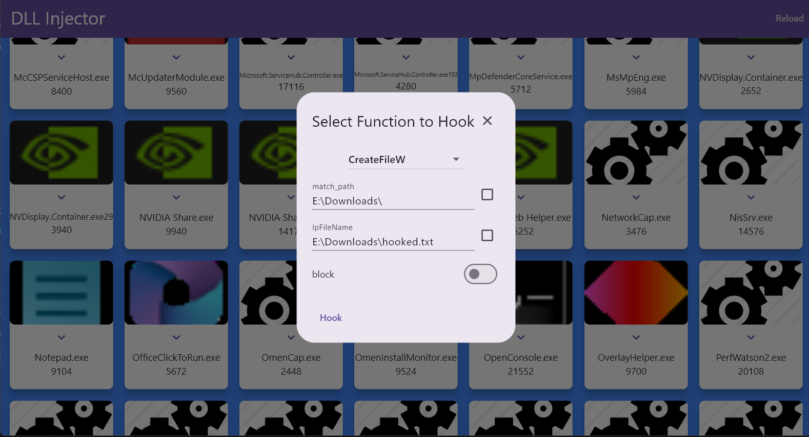
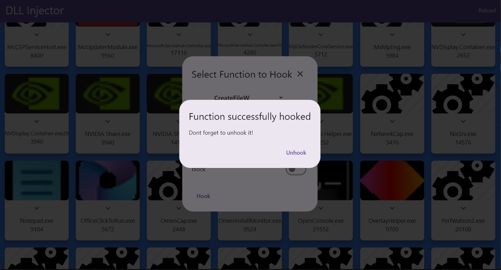

# About

As the name suggests, the application primarily performs injecting a dll into any process running on windows. With the power of this, it is able to perform several
operations on a process such as loading a dll, unloading a dll, hooking primary winapi functions(eg:- CreateFileW,ReadFile, etc). Its frontend is built using flutter 
and core functionality is performed using c++.This project bridges the gap in the availability of simplified and effective tools for debugging and behaviour modification of Windows processes. Current tools either lack user accessibility due to complexity or do not offer sufficient functionality for comprehensive system-level operations.


# Functions

• The ability to list all running processes, select a target, and inject a DLL.
• Hooking support for specific Windows API functions and modification of parameters in
real-time.
• Check for presence of a specific function in a process(only works for exported functions).
• The ability to unload DLLs from target processes.


## 🪝 Hooking a Function — Getting Started

The application can be downloaded from releases section. This section shows how to use the UI to hook a function into a running process. For this example, we'll hook the `CreateFileW` function in **Notepad.exe** and configure it to block access to a specific file.

---

### 🔹 Step 1: Select a Target Process

Start by launching the DLL Injector application. You'll see a grid of running processes with their names and Process IDs (PIDs).

➡ **Click on the hook option for `Notepad.exe`**.

```

```

---

### 🔹 Step 2: Configure the Hook

After selecting a process, a popup will appear prompting you to configure which function to hook and under what conditions.

In this example:
- **Function**: `CreateFileW`
- **match_path**: `E:\Downloads\`
- **lpFileName**: `E:\Downloads\hooked.txt`
- **block**: Disabled (to allow execution)

Once configured, click **Hook** to inject the DLL and activate the hook.

```

```

---

### 🔹 Step 3: Hook Success Confirmation

If the hook was applied successfully, you'll see a confirmation dialog.
You must press **"Unhook"** when you're done, to safely remove the hook from the target process.
If the hook is not removed the process should be manually restarted again.


```

```

---

To check what happend save something to 'E:\Downloads\'. No matter what the file will be named as 'hooked.txt'.
